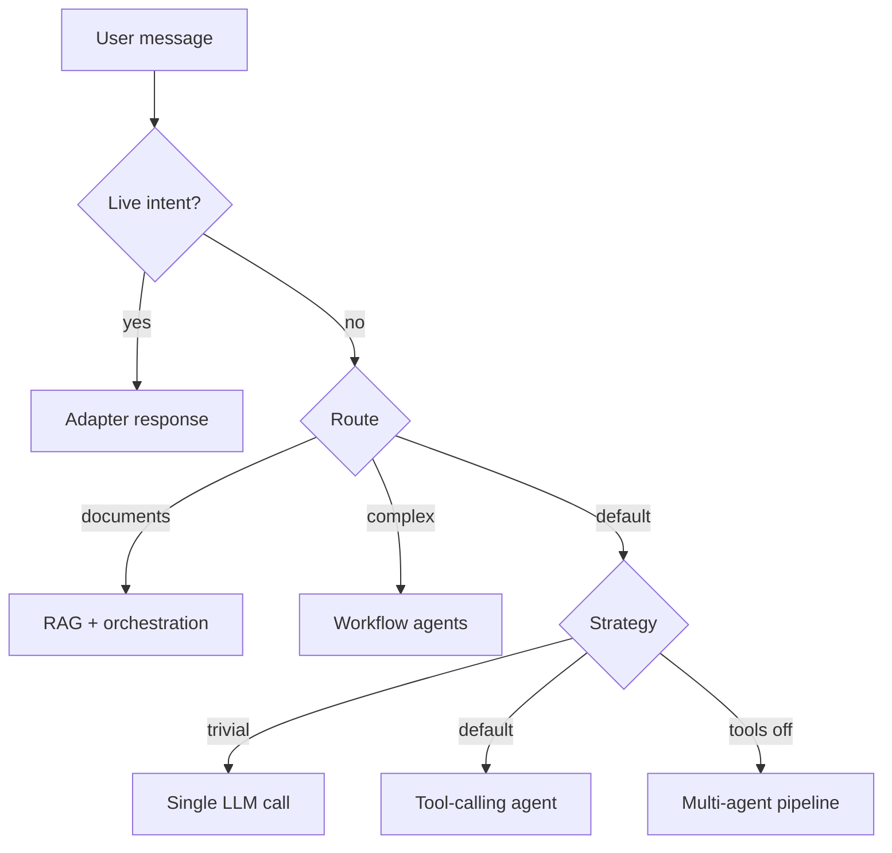

# Personal AI

Monorepo for a **multi-user**, retrieval-augmented assistant with live data, tool calling, and optional multi-agent workflows. Backend is FastAPI + PostgreSQL + Qdrant + Ollama (or cloud LLMs). Frontend is a Vite + React + Tailwind chat UI with **Chat** and **Smart** modes, server-synced history, and light/dark themes.

## What it does today

| Capability | Status |
|------------|--------|
| Multi-user auth + Postgres persistence | ✅ JWT/OIDC-ready (`AUTH_DISABLED=true` for local dev) |
| Per-user RAG (Qdrant scoped by `user_id`) | ✅ |
| Live data (FX, stocks, weather, news) | ✅ Deterministic short-circuit before LLM |
| Fast single-call chat | ✅ Greetings / trivial prompts (`ENABLE_FAST_CHAT`) |
| Tool-calling agent (web + live tools) | ✅ Native agent via `ToolRegistry` (`ENABLE_TOOL_AGENT`) |
| Unified chat with auto-routing (`chat` / `rag` / `workflow`) | ✅ `POST /chat` |
| Multi-agent workflow + SSE trace | ✅ `/workflow_chat`, `/chat/stream` |
| Cloud LLM (Groq, DeepSeek, Together, etc.) | ✅ `cloud-chat` Compose profile |
| Background workers (ingest) | ✅ Optional `workers` profile |
| Runtime MCP connectors in chat UI | ✅ MCP servers + tool permissions (Agent settings) |
| User skills + agent tasks + diagnostics | ✅ Bundled skills, `/agent/*` APIs, Doctor tab |

Phases 0–3 of the product roadmap are complete. See [docs/roadmap.md](docs/roadmap.md).

## Stack overview

- **Backend** (`app/`): FastAPI, SQLAlchemy + Alembic, orchestrated chat, live-data adapters, tool registry.
- **Database**: PostgreSQL (users, conversations, messages, documents).
- **Vector store**: Qdrant with per-user payload filters.
- **Cache / queue**: Redis (adapter cache, optional ARQ workers, optional run/memory backends).
- **Model runtime**: Ollama for local chat + embeddings, or OpenAI-compatible cloud/GPU endpoints for chat.
- **Frontend** (`frontend/`): React 19, Vite 7, TanStack Query, voice input, uploads, workflow trace UI.

## Prerequisites

- Docker + Docker Compose (recommended), or local Python 3.11+ / Node 18+
- [Ollama](https://ollama.com) for local chat and/or embeddings (`nomic-embed-text` required for RAG)
- Pull models once (local profile): `ollama pull llama3:8b` and `ollama pull nomic-embed-text`

## Quick start with Docker (recommended)

```bash
cp .env.example .env
make up          # profile: local (Ollama chat + embeds)
make db-migrate  # create Postgres tables (first run)
make pull-models # optional if models not yet in Ollama container
```

Access:

| Service | URL |
|---------|-----|
| App (API + built frontend) | http://localhost:8000 |
| Ollama | http://localhost:11434 |
| Qdrant | http://localhost:6333 |
| Prometheus | http://localhost:9090 |
| Grafana | http://localhost:3000 |

Frontend dev server (optional): `cd frontend && npm install && npm run dev` → http://localhost:5173

### Useful commands

```bash
make help           # all Makefile targets
make logs           # tail all services
make down           # stop stack
make real-api-smoke # health + live FX/weather smoke (app on :8000)
make model-stress-local   # LLM load test (remote inference)
make quality-gate   # backend tests + compose validation
```

## Runtime modes (Compose profiles)

See [docs/compose-profiles.md](docs/compose-profiles.md) for details.

| Profile | Command | Chat | Embeddings |
|---------|---------|------|------------|
| **local** (default) | `make up` | Ollama | Ollama |
| **cloud-chat** | `make up-cloud` | Cloud OpenAI-compatible API | Ollama |
| **gpu-vllm** | `make up-gpu-vllm` | Local vLLM on :8001 | Ollama |
| **remote** | `make up-remote` | LM Studio on Mac Mini (:1234) | Ollama on Mac Mini (:11434) |
| **workers** | `make up-workers` | Same as local + ARQ worker | Ollama |

**Remote inference (MacBook Docker + Mac Mini models over Ethernet):**

```bash
cp .env.remote.example .env.remote
# Mac Mini LM Studio @ 192.168.10.1:1234, Ollama @ 192.168.10.1:11434
# Model id: qwen-3-14b-instruct (see curl http://192.168.10.1:1234/v1/models)
make up-remote
make db-migrate
```

Verify Mac Mini from the app container:

```bash
curl http://192.168.10.1:1234/api/v1/models   # LM Studio native API
curl http://192.168.10.1:1234/v1/models       # OpenAI-compatible (use "id" in .env)
curl http://192.168.10.1:11434/api/tags       # Ollama embeddings
```

Tailscale (`100.67.46.46`) remains a fallback if Ethernet is unavailable — update `OLLAMA_BASE_URL` and `LLM_OPENAI_BASE_URL` in `.env.remote`.

**Cloud chat setup:**

```bash
cp .env.cloud.example .env.cloud
# Enable one provider block (e.g. Groq, DeepSeek) and set LLM_CLOUD_API_KEY
make up-cloud
make db-migrate
```

Tiered Groq example (fast planner/reviewer, stronger writer): see commented models in `.env.cloud.example`.

Verify active provider inside the app container:

```bash
docker compose exec app env | grep -E "LLM_DEFAULT_PROVIDER|LLM_OPENAI_BASE_URL|ENABLE_TOOL"
```

## How chat works

### Chat modes

**Chat** (`POST /chat/stream`) — direct fast path. **Smart** (`POST /smart_chat/stream`) — automatic routing:

1. **Live-data short-circuit** — FX, weather, stocks, news, nearby places, etc.
2. **Route selection (Smart only)** — `chat`, `rag` (your documents), or `workflow` (multi-agent plan + trace)
3. **Chat execution** — within `chat`, pick fast / tool agent / orchestrated pipeline



| Path | When | Typical LLM calls |
|------|------|-------------------|
| **Fast** | `hi`, `thanks`, short chitchat | 1 |
| **Tools** | Default when `ENABLE_TOOL_AGENT=true` | 1–4 (model picks tools) |
| **Orchestrated** | `ENABLE_TOOL_AGENT=false` | 4+ (researcher → synthesizer → reviewer → writer) |
| **RAG** | Queries about your uploaded documents | 2+ |
| **Workflow** | Multi-step research, comparisons, live + web tasks | 4+ |

Built-in tools (registered in `ToolRegistry`, exposed to the agent): `fx_rate`, `market_price`, `weather`, `weather_forecast`, `news`, `web_search`, `find_nearby_places`. List them with `GET /tools?role=chat_agent`.

## Chat modes (`POST /chat` vs `POST /smart_chat`)

The web UI exposes **Chat** and **Smart** in the sidebar.

- **Chat** → `POST /chat/stream` — direct fast path (`execute_chat_mode`); live-data short-circuit still applies.
- **Smart** → `POST /smart_chat/stream` — `_select_smart_mode` routes to `chat`, `rag`, or `workflow`.

`POST /smart_chat` and `/smart_chat/stream` are the smart-routing entrypoints (not deprecated aliases).

## Authentication

Local development defaults to `AUTH_DISABLED=true` (a dev user is injected automatically; no token required).

With auth enabled, obtain a JWT and send `Authorization: Bearer <token>` on API calls:

```bash
curl -s -X POST http://localhost:8000/auth/token \
  -H "Content-Type: application/json" \
  -d '{"email":"you@example.com"}'
```

Conversation and message APIs are scoped per user. RAG ingest and search filter Qdrant by `user_id`.

## API endpoints

### Chat

| Endpoint | Description |
|----------|-------------|
| `POST /chat` | Direct chat (fast path; no smart auto-routing) |
| `POST /chat/stream` | SSE stream for direct chat |
| `POST /smart_chat` | Smart chat with auto-routing (live data, chat / rag / workflow) |
| `POST /smart_chat/stream` | SSE stream for smart chat |
| `POST /rag_chat` | RAG-grounded chat with citations |
| `POST /workflow_chat` | Explicit workflow with trace |
| `POST /workflow_chat/stream` | SSE workflow stream |
| `POST /workflow_chat/background` | Enqueue long workflow to worker |
| `POST /ingest` | Upload documents (`multipart/form-data`, field `files`) |

Request body (chat): `{ "messages": [{"role":"user","content":"..."}], "conversation_id": "<uuid>" }`  
Shorthand: `{ "message": "..." }` is also accepted.

### Conversations

| Endpoint | Description |
|----------|-------------|
| `GET /conversations` | List conversations for current user |
| `POST /conversations` | Create conversation |
| `GET /conversations/{id}/messages` | Message history |
| `DELETE /conversations/{id}` | Delete conversation |

Create with an optional `assistant_id` to bind a skill/assistant for the whole thread. Use `"default"` or omit for the general CurAI assistant.

### Assistants & agent settings

| Endpoint | Description |
|----------|-------------|
| `GET /agent/assistants` | List assistants (includes synthetic `default`) |
| `POST /agent/assistants` | Create a pick-only custom assistant |
| `PATCH /agent/assistants/{id}` | Update or enable/disable bundled assistants |
| `DELETE /agent/assistants/{id}` | Delete a custom assistant |

In the UI, pick an assistant from the sidebar before starting a conversation, or manage assistants under **Agent settings → Assistants**. Bundled skills (for example live-brief) appear as assistants; custom ones are explicit-pick only.

### OpenAI-compatible API (`/v1`)

CurAI exposes a subset of the OpenAI Chat Completions API on the same host, using the same JWT auth as the web app (`Authorization: Bearer …`). Set `ENABLE_OPENAI_API=false` to disable.

| Endpoint | Description |
|----------|-------------|
| `GET /v1/models` | Lists `curai-default`, `curai-tools`, `curai-fast` |
| `POST /v1/chat/completions` | Chat completion (JSON or SSE when `stream: true`) |

Models map to execution strategies: `curai-tools` forces the tool agent; `curai-fast` forces fast chat; `curai-default` uses normal routing. Pass `metadata.assistant_id` or top-level `assistant_id` to bind a skill for that request.

Example (local dev with auth disabled):

```bash
curl -s http://localhost:8000/v1/models | python3 -m json.tool

curl -s -X POST http://localhost:8000/v1/chat/completions \
  -H "Content-Type: application/json" \
  -d '{"model":"curai-default","messages":[{"role":"user","content":"hello"}]}' \
  | python3 -m json.tool
```

Use this from Cursor, scripts, or any OpenAI SDK by pointing `base_url` at your CurAI host and supplying a valid bearer token when auth is enabled.

### Tools, workflow runs, jobs

| Endpoint | Description |
|----------|-------------|
| `GET /tools?role=chat_agent` | Tools available to the chat agent |
| `POST /workflow_runs` | Create workflow run record |
| `GET /workflow_runs` | List runs (by `conversation_id`) |
| `GET /workflow_runs/{run_id}` | Fetch run |
| `POST /workflow_runs/{run_id}/pause` | Pause run |
| `POST /workflow_runs/{run_id}/resume` | Resume run |
| `POST /workflow_runs/{run_id}/cancel` | Cancel run |
| `GET /jobs/{job_id}` | Background job status (ingest / workflow) |

### Health & observability

| Endpoint | Description |
|----------|-------------|
| `GET /health` | Liveness |
| `GET /ready` | Readiness (Qdrant + Ollama) |
| `GET /metrics` | Prometheus scrape |

Chat responses include optional `latency_ms` (milliseconds, end-to-end handler time). Persisted on assistant messages in Postgres metadata for history reload.

## Configuration

Copy `.env.example` → `.env`. Important flags:

```bash
# Chat execution (Phase A — on by default)
ENABLE_FAST_CHAT=true
ENABLE_TOOL_AGENT=true
ENABLE_OPENAI_API=true

# Auth (local dev)
AUTH_DISABLED=true

# Optional: cloud / per-stage models (see .env.cloud.example)
LLM_DEFAULT_PROVIDER=ollama          # or openai in cloud-chat profile
LLM_PLANNER_MODEL=...
LLM_SYNTHESIZER_MODEL=...
```

Full variable list: `.env.example`, `.env.cloud.example`, `.env.remote.example`, [docs/ops-runbook.md](docs/ops-runbook.md).

Assistant behavior is governed by `app/prompts/system.md` (seven traits — see [docs/traits.md](docs/traits.md)).

## Backend setup (without Docker)

```bash
python3 -m venv .venv
source .venv/bin/activate
pip install -r requirements.txt
cp .env.example .env
# Start Postgres + Qdrant + Ollama separately, then:
alembic upgrade head
uvicorn app.main:app --reload
```

## Frontend setup

```bash
cd frontend
npm install
# frontend/.env — point at API:
# VITE_API_BASE_URL=http://localhost:8000
npm run dev
```

**UI highlights:** Chat vs Smart mode toggle, assistant picker in the sidebar, server-synced conversations (TanStack Query), per-message response time, mobile navigation drawer, Capacitor iOS/Android shells, voice input, file upload (`.txt`, `.md`, `.pdf`), light/dark theme in the account menu.

Native apps: [frontend/CAPACITOR.md](frontend/CAPACITOR.md). Production URL: `https://app.cura-i.com`.

Production build: `npm run build` (also baked into the Docker app image).

## Example: cloud chat smoke test

```bash
make up-cloud && make db-migrate

curl -s -X POST http://localhost:8000/chat \
  -H "Content-Type: application/json" \
  -d '{"message": "hello"}' | python3 -m json.tool

curl -s http://localhost:8000/tools | python3 -m json.tool
```

For non-trivial questions, the tool agent may call `web_search` or live-data tools before answering. Live FX/weather/stock intents often return directly from adapters without an LLM call.

## Testing

```bash
./scripts/quality_gate.sh              # full repo gate
./.venv/bin/python3 -m pytest          # backend tests
cd frontend && npm run test:e2e          # Playwright flows
cd frontend && npm run test:capacitor    # mobile drawer + user menu theme
bash scripts/compose_smoke.sh            # compose smoke
make real-api-smoke                     # live provider + HTTP checks
make model-stress-local                 # concurrent chat load (see docs)
make model-accuracy-smoke               # LLM + live-data accuracy
```

Benchmark results (smoke + stress, local + prod): [docs/model-stress-testing.md](docs/model-stress-testing.md) and [docs/results/](docs/results/).

## Documentation

| Doc | Topic |
|-----|--------|
| [docs/README.md](docs/README.md) | **Documentation index** |
| [docs/model-stress-testing.md](docs/model-stress-testing.md) | Smoke/stress benchmarks + scripts |
| [docs/results/](docs/results/) | JSON result artifacts |
| [docs/roadmap.md](docs/roadmap.md) | Phased plan (0–3 complete) |
| [docs/architecture.md](docs/architecture.md) | Components and data flow |
| [docs/live-data-flow.md](docs/live-data-flow.md) | Live adapters and guardrails |
| [docs/compose-profiles.md](docs/compose-profiles.md) | Docker profiles |
| [docs/cloud-deploy-aws.md](docs/cloud-deploy-aws.md) | EKS / Helm deploy |
| [docs/gpu-deployment.md](docs/gpu-deployment.md) | vLLM / GPU chat |
| [docs/mcp-servers.md](docs/mcp-servers.md) | IDE MCP setup (Cursor) |
| [docs/penpot-mcp.md](docs/penpot-mcp.md) | Penpot design MCP |
| [docs/traits.md](docs/traits.md) | Assistant governance |
| [docs/ops-runbook.md](docs/ops-runbook.md) | Operations and troubleshooting |
| [docs/ui-reference.md](docs/ui-reference.md) | Chat UI layout and mobile behavior |
| [frontend/README.md](frontend/README.md) | Frontend dev and tests |
| [frontend/CAPACITOR.md](frontend/CAPACITOR.md) | iOS/Android native apps |
| [docker-setup.md](docker-setup.md) | Detailed Docker guide |

## Troubleshooting

- **500 on `/chat` after first deploy**: Run `make db-migrate` (Postgres tables missing).
- **Ollama 404 on `/api/embed`**: Pull `nomic-embed-text` (`make pull-models-cloud` or `./scripts/deploy_prod.sh`).
- **Playwright visual failures on CI**: CI runs on Linux; commit both `*-darwin.png` (local) and `*-linux.png` baselines. Regenerate Linux snapshots with `npm run test:visual:update:linux` from `frontend/`.
- **Groq 429 rate limits**: Use tiered models in `.env.cloud` (8B for planner/reviewer, larger model for writer only) or space out requests; Smart workflow mode issues more LLM calls than direct Chat.
- **DeepSeek ReadTimeout in workflow mode**: Raise `LLM_CLOUD_TIMEOUT` to `180` (or higher); `deepseek-v4-pro` on the writer stage with RAG context can exceed 30–60s.
- **Tool agent errors**: Chat tool routing uses the native ToolRegistry executor (OpenAI-compatible API or Ollama `/api/chat` with tools). Use a model with tool-calling support; for local Ollama, prefer `llama3.1` or newer.
- **Speech input unavailable**: Web Speech API is browser-dependent (Chrome works best).

## What's next

- **Phase C**: Runtime MCP client in the app (GitHub, Supabase, Penpot from chat UI)
- Connector settings UI and per-user OAuth
- RAG exposed as a `ToolRegistry` tool for the agent

Track progress in [docs/roadmap.md](docs/roadmap.md) and [docs/multi-agent-improvement-roadmap.md](docs/multi-agent-improvement-roadmap.md).
