# Architecture

## System Overview

Personal AI is a single-repo local assistant with a FastAPI backend, a Vite/React frontend, deterministic live-data adapters, and an observability stack.

---

## High-Level Component Map

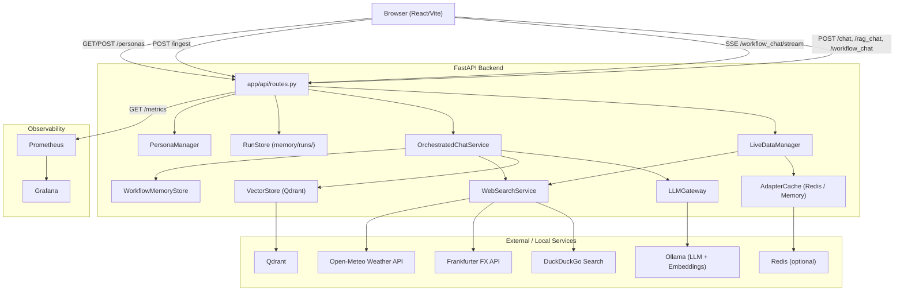

---

## Smart-Mode Routing (POST /smart_chat)

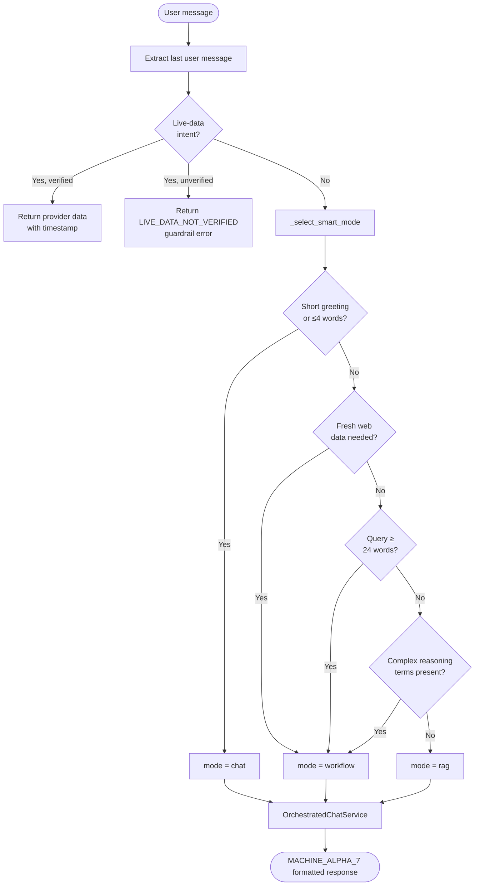

---

## Runtime Components

| File | Responsibility |
|------|---------------|
| `app/main.py` | Creates the FastAPI app, applies CORS, serves built frontend from `/app/frontend_dist` |
| `app/api/routes.py` | Owns `/chat`, `/rag_chat`, `/workflow_chat`, `/workflow_chat/stream`, `/workflow_runs*`, `/ingest`, `/metrics`, `/personas*` |
| `app/services/orchestrated_chat.py` | Shared orchestration engine for chat, RAG, and workflow modes |
| `app/services/workflow_roles.py` | Per-agent role instructions: coordinator, retriever, researcher, synthesizer, reviewer, writer |
| `app/services/workflow_memory.py` | File-backed conversation-scoped memory store |
| `app/services/ollama.py` | Async client wrapping Ollama chat and embed endpoints |
| `app/services/llm_gateway.py` | Adapter layer supporting Ollama and OpenAI-compatible backends |
| `app/services/vector_store.py` | Qdrant wrapper for storing and searching embedded chunks |
| `app/services/live_data_manager.py` | Routes live-intent queries through deterministic providers before generative fallback |
| `app/services/web_search.py` | DuckDuckGo search and live data provider integrations (FX, weather, news, stocks) |
| `app/services/adapter_cache.py` | Redis or in-memory TTL cache for normalized adapter responses |
| `app/services/run_store.py` | Durable run records with lifecycle events and checkpoints |
| `app/services/sandbox_policy.py` | Tool-invocation policy enforcement and dangerous-command blocking |
| `app/services/persona_manager.py` | Loads persona files and generates dynamic system prompts |
| `frontend/src/App.tsx` | Top-level UI state, mode switching, uploads, and message history |
| `frontend/src/api.ts` | Browser API client with localhost/remote fallback and Safari retry logic |

---

## Request Paths

### Standard Chat (`POST /chat`)

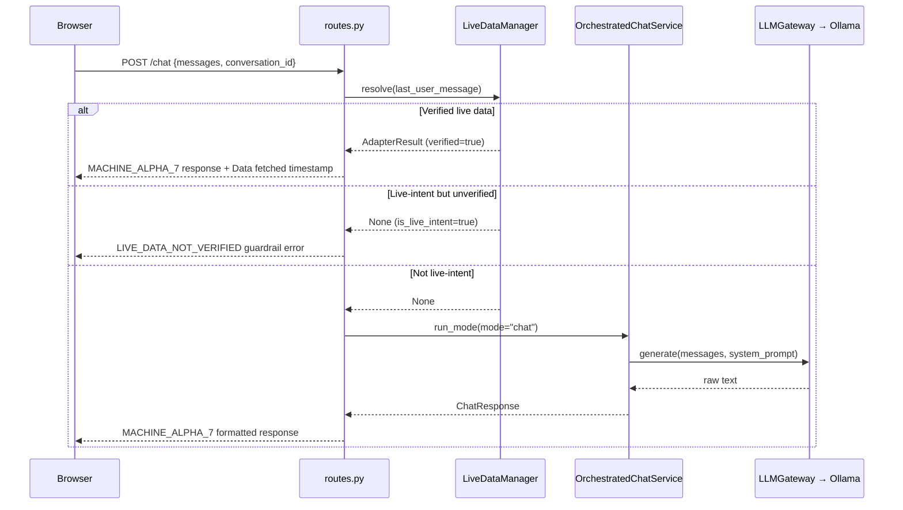

---

### Retrieval-Augmented Chat (`POST /rag_chat`)

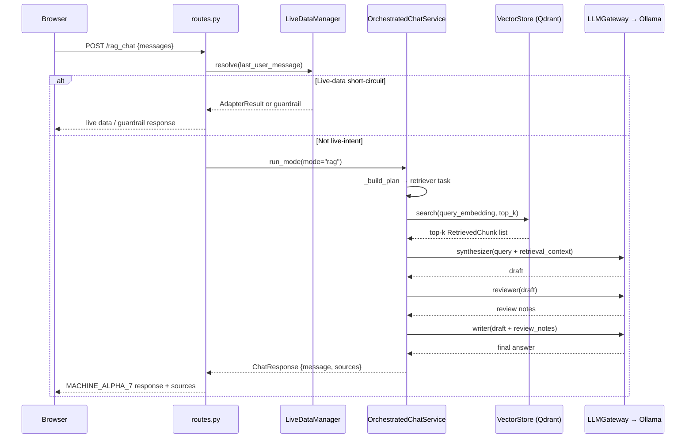

---

### Multi-Agent Workflow Chat (`POST /workflow_chat`)

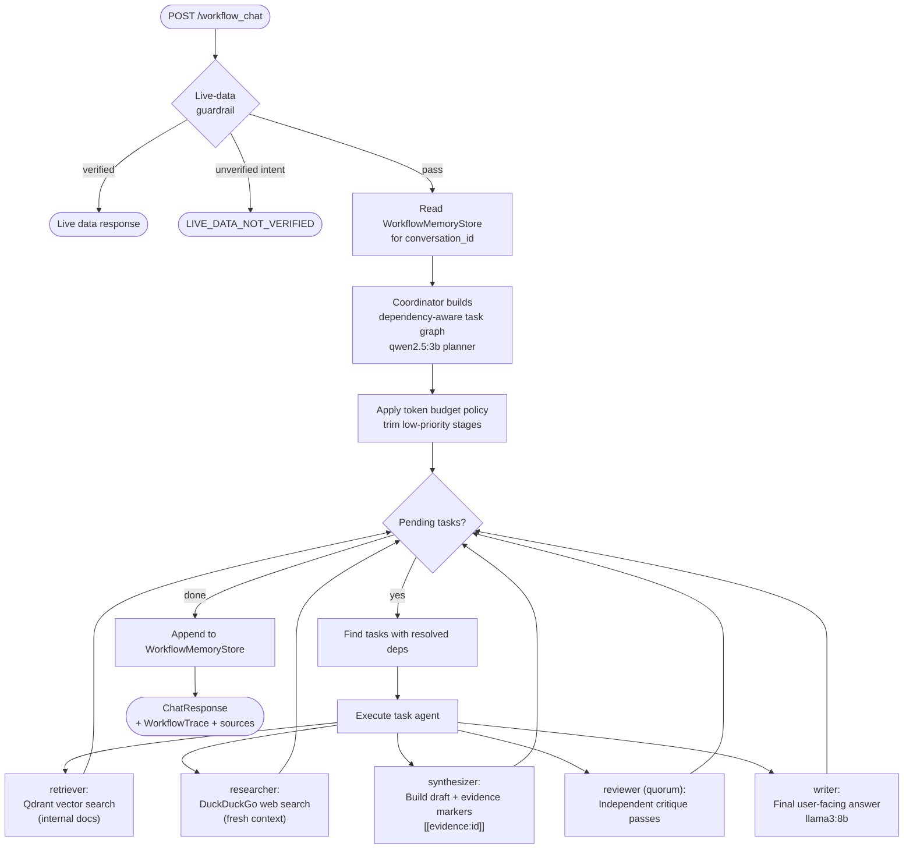

---

### Streaming Workflow Events (`POST /workflow_chat/stream`)

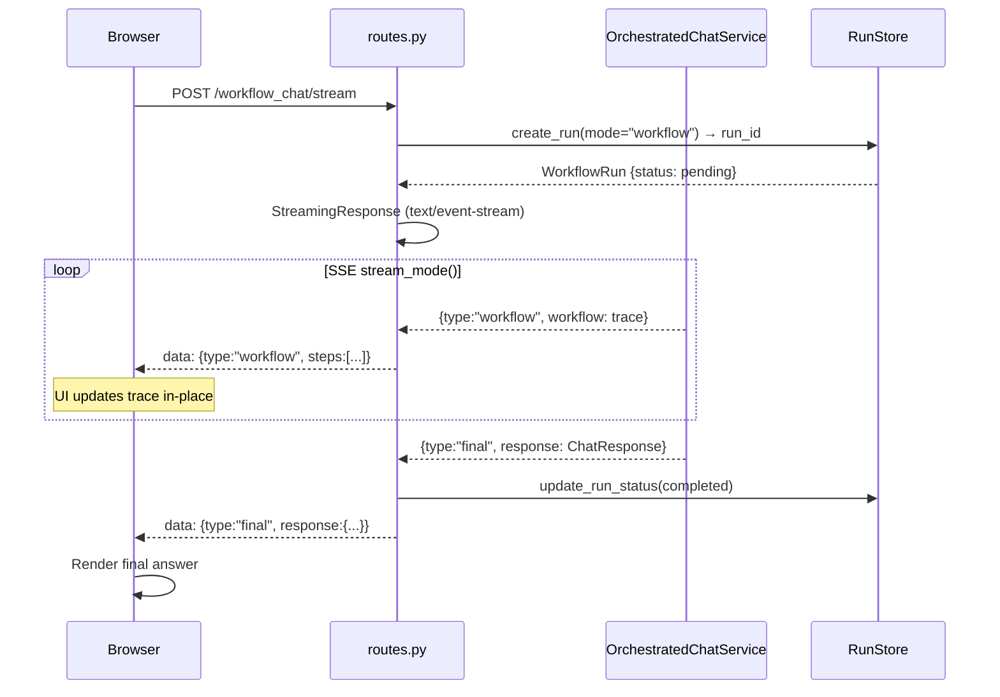

---

### Workflow Run Lifecycle

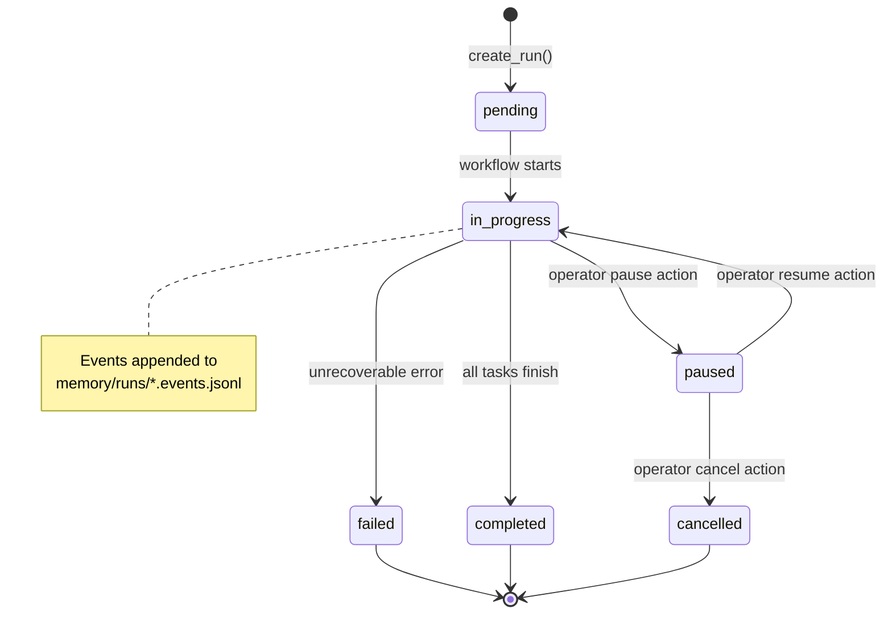

---

### Document Ingestion (`POST /ingest`)

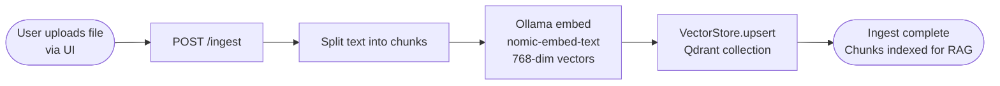

---

### Evidence and Reviewer Quorum

```mermaid
flowchart TD
    Retrieval[Retriever chunks\ntrust_lane=retrieved] --> Evidence[Evidence pool\ntagged by trust lane]
    WebSearch[Web results\ntrust_lane=verified_web] --> Evidence
    Evidence --> Synth[Synthesizer\ncites evidence markers\n[[evidence:id]]]
    Synth --> Check{Evidence markers\npresent?}
    Check -- No markers,\nbut evidence exists --> Warn([Verification warning\ninstead of unsupported claim])
    Check -- Markers present --> Quorum[Reviewer quorum\ndefault 2 independent passes]
    Quorum --> Agg[Aggregate review notes]
    Agg --> Writer[Writer uses\nreviewed draft]
    Writer --> Final([Final answer])
```

---

### Safety and Governance Controls

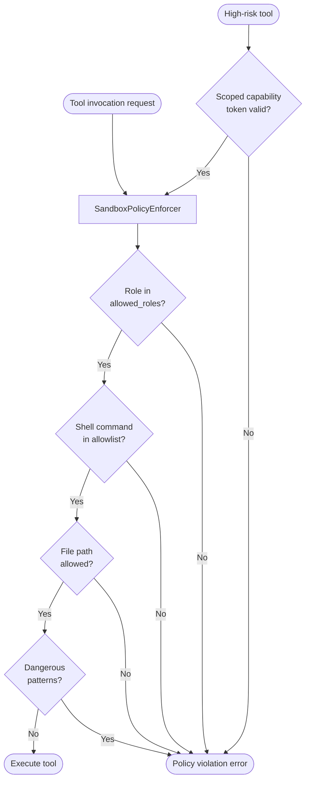

---

## Frontend State Model

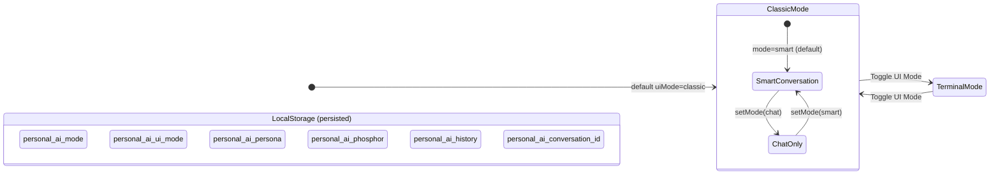

**Key localStorage keys:**

| Key | Values | Description |
|-----|--------|-------------|
| `personal-ai-mode` | `smart`, `chat` | Conversation routing mode |
| `personal-ai-ui-mode` | `classic`, `terminal` | UI render mode |
| `personal-ai-persona` | `ideal_chatbot`, `therapist`, `barney` | Active persona |
| `personal-ai-phosphor` | `green`, `amber` | Terminal phosphor color |
| `personal-ai-history` | `ChatMessage[]` | Full chat history |
| `personal-ai-conversation-id` | UUID | Workflow memory key |

---

## Data Stores

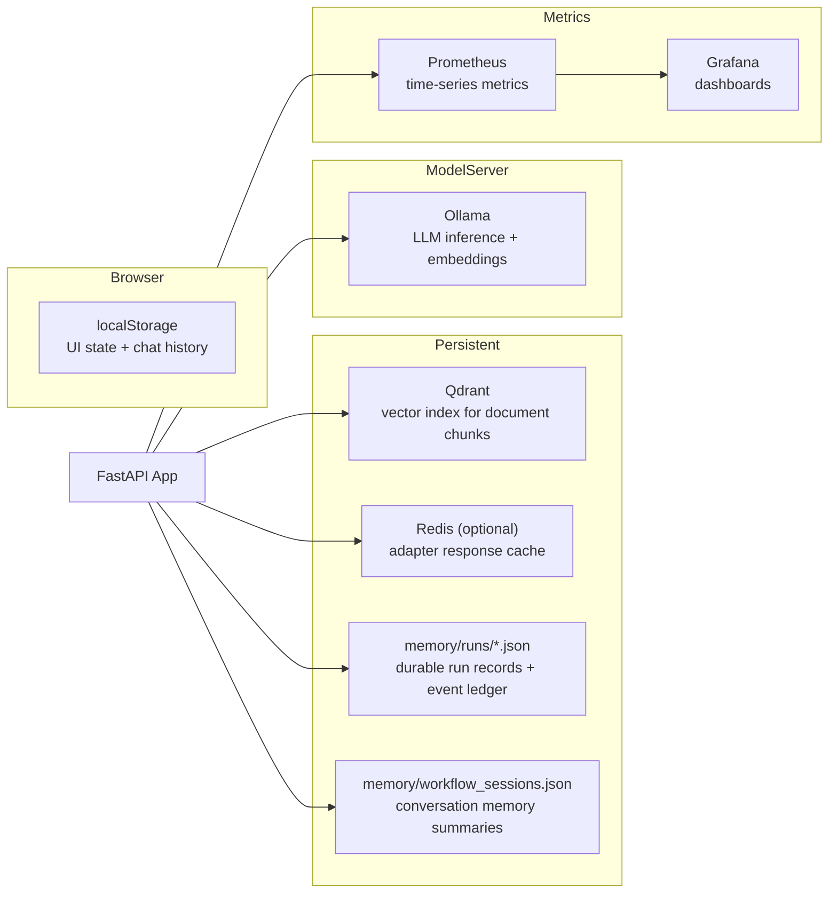

---

## Observability

- `GET /metrics` exposes Prometheus text format.
- `live_adapter_requests_total` — adapter hits labelled by domain, status, source, cache_hit.
- `live_adapter_latency_seconds` — provider latency histogram.
- Prometheus scrapes both itself and the app.
- Grafana is provisioned against the internal `http://prometheus:9090` compose address.

---

## Quality Gate

The repo-level gate is `scripts/quality_gate.sh`. It validates compose config, runs security checks, compiles Python, runs pytest, lints the frontend, builds the frontend, runs Playwright flow and visual tests, and builds the backend image.

---

## Key Constraints

- Live-intent queries must never fall through to unverifiable generation.
- The containerized app serves the frontend from the backend container, so UI changes require rebuilding the app image for compose-based verification.
- Local developer experience supports both direct backend/frontend development and full compose-based stack verification.