# Architecture

## System Overview

Personal AI is a single-repo local assistant with a FastAPI backend, a Vite/React frontend, deterministic live-data adapters, and an observability stack.

---

## High-Level Component Map

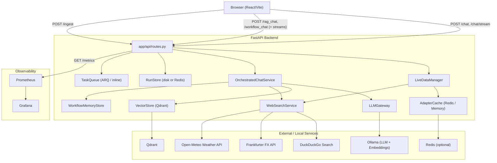
```mermaid
graph TD
    Browser["Browser (React/Vite)"]

    subgraph Backend ["FastAPI Backend"]
        Routes["app/api/routes.py"]
        Orchestrator["OrchestratedChatService"]
        LiveData["LiveDataManager"]
        LLMGateway["LLMGateway"]
        VectorStore["VectorStore (Qdrant)"]
        WebSearch["WebSearchService"]
        AdapterCache["AdapterCache (Redis / Memory)"]
        RunStore["RunStore (disk or Redis)"]
        WorkflowMemory["WorkflowMemoryStore"]
        TaskQueue["TaskQueue (ARQ / inline)"]
    end

    subgraph ExternalServices ["External / Local Services"]
        Ollama["Ollama (LLM + Embeddings)"]
        Qdrant["Qdrant"]
        Redis["Redis (optional)"]
        DuckDuckGo["DuckDuckGo Search"]
        FrankfurterAPI["Frankfurter FX API"]
        WeatherAPI["Open-Meteo Weather API"]
    end

    subgraph Observability
        Prometheus["Prometheus"]
        Grafana["Grafana"]
    end

    Browser -- "POST /chat, /chat/stream" --> Routes
    Browser -- "POST /rag_chat, /workflow_chat (+ streams)" --> Routes
    Browser -- "POST /ingest" --> Routes

    Routes --> LiveData
    Routes --> Orchestrator
    Routes --> RunStore
    Routes --> TaskQueue

    LiveData --> AdapterCache
    LiveData --> WebSearch

    Orchestrator --> LLMGateway
    Orchestrator --> VectorStore
    Orchestrator --> WebSearch
    Orchestrator --> WorkflowMemory

    LLMGateway --> Ollama
    VectorStore --> Qdrant
    AdapterCache --> Redis

    WebSearch --> DuckDuckGo
    WebSearch --> FrankfurterAPI
    WebSearch --> WeatherAPI

    Routes -- "GET /metrics" --> Prometheus
    Prometheus --> Grafana
```

---

## Chat modes (`POST /chat` / `POST /smart_chat`)

The web UI has a **Chat vs Smart** toggle in the sidebar.

| UI mode | Endpoint | Behavior |
|---------|----------|----------|
| **Chat** | `POST /chat/stream` | Direct fast path; no smart auto-routing to RAG/workflow |
| **Smart** | `POST /smart_chat/stream` | `_select_smart_mode` → `chat`, `rag`, or `workflow` |

Live-data short-circuit runs first on both paths.

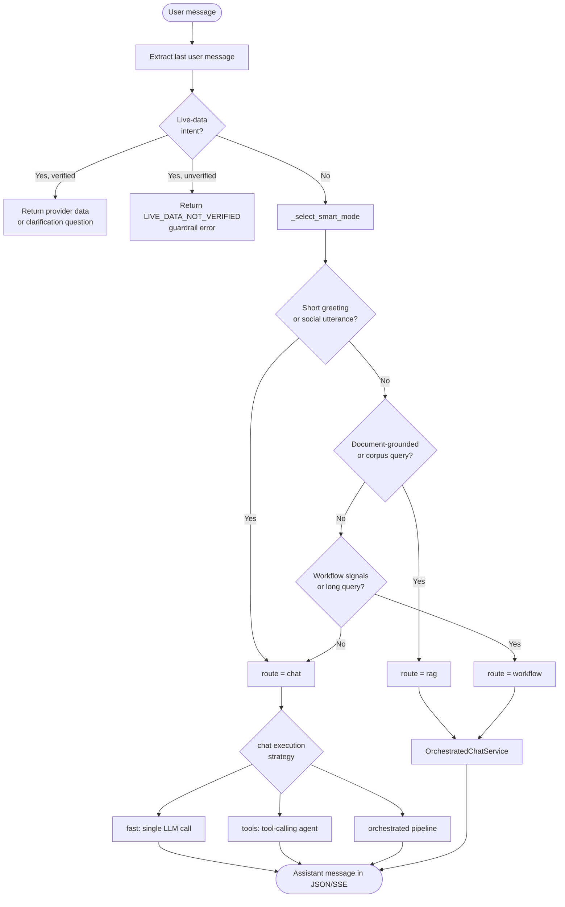
```mermaid
flowchart TD
    Start([User message]) --> Extract[Extract last user message]
    Extract --> LiveCheck{Live-data\nintent?}
    LiveCheck -- Yes, verified --> LiveReturn[Return provider data\nor clarification question]
    LiveCheck -- Yes, unverified --> GuardrailReturn[Return LIVE_DATA_NOT_VERIFIED\nguardrail error]
    LiveCheck -- No --> Route[_select_smart_mode]
    Route --> Greet{Short greeting\nor social utterance?}
    Greet -- Yes --> ChatRoute[route = chat]
    Greet -- No --> Docs{Document-grounded\nor corpus query?}
    Docs -- Yes --> RagRoute[route = rag]
    Docs -- No --> Complex{Workflow signals\nor long query?}
    Complex -- Yes --> WfRoute[route = workflow]
    Complex -- No --> ChatRoute
    ChatRoute --> ChatExec{chat execution\nstrategy}
    ChatExec --> Fast[fast: single LLM call]
    ChatExec --> Tools[tools: tool-calling agent]
    ChatExec --> Orch[orchestrated pipeline]
    RagRoute --> Orchestrator[OrchestratedChatService]
    WfRoute --> Orchestrator
    Fast --> FinalResponse([Assistant message in JSON/SSE])
    Tools --> FinalResponse
    Orch --> FinalResponse
    Orchestrator --> FinalResponse
```

**Route selection** (`_select_smart_mode` in `app/api/routes.py`):

| Route | When |
|-------|------|
| `chat` | Greetings, general Q&A, tool-friendly prompts (default) |
| `rag` | Queries about uploaded documents or corpus overviews |
| `workflow` | Multi-step reasoning, comparisons, long prompts (24+ words), explicit workflow terms |

Within `chat`, **`resolve_chat_execution_strategy`** picks `fast`, `tools`, or `orchestrated` (see README).

Response header on streams: **`X-Chat-Route`** (`chat`, `rag`, or `workflow`).

---

## Runtime Components

| File | Responsibility |
|------|---------------|
| `app/main.py` | Creates the FastAPI app, applies CORS, serves built frontend from `/app/frontend_dist` |
| `app/api/routes.py` | Owns `/chat`, `/chat/stream`, `/rag_chat`, `/workflow_chat`, `/workflow_chat/background`, `/workflow_chat/stream`, `/workflow_runs*`, `/ingest`, `/metrics`; deprecated `/smart_chat*` aliases |
| `app/services/chat_execution.py` | Fast / tool-agent / orchestrated execution within `chat` route |
| `app/services/orchestrated_chat.py` | Shared orchestration engine for chat, RAG, and workflow modes |
| `app/services/workflow_roles.py` | Per-agent role instructions: coordinator, retriever, researcher, synthesizer, reviewer, writer |
| `app/services/workflow_memory.py` | Conversation-scoped workflow memory (disk or Redis) |
| `app/services/task_queue.py` | Enqueues ingest and background workflows via ARQ or inline fallback |
| `app/workers/tasks.py` | ARQ worker jobs: async ingest, background workflow, scheduled reports cron |
| `app/services/ollama.py` | Async client wrapping Ollama chat and embed endpoints |
| `app/services/llm_gateway.py` | Adapter layer supporting Ollama and OpenAI-compatible backends |
| `app/services/vector_store.py` | Qdrant wrapper for storing and searching embedded chunks |
| `app/services/live_data_manager.py` | Routes live-intent queries (FX, weather, news, nearby places, …) through deterministic providers |
| `app/services/local_places.py` | Nearby-places detection, geocoding, and OpenStreetMap fetch |
| `app/services/nearby_places_clarification.py` | Hybrid clarification gate (rules + planner LLM) for ambiguous location queries |
| `app/services/web_search.py` | DuckDuckGo search and live data provider integrations |
| `app/services/adapter_cache.py` | Redis or in-memory TTL cache for normalized adapter responses |
| `app/services/run_store.py` | Durable run records with lifecycle events (disk or Redis) |
| `app/services/job_store.py` | Background job status in Redis or memory |
| `app/services/sandbox_policy.py` | Tool-invocation policy enforcement and dangerous-command blocking |
| `frontend/src/App.tsx` | Top-level UI: conversations, composer, uploads, settings; Chat/Smart mode toggle |
| `frontend/src/api.ts` | Browser API client; `sendMessage` uses `/chat/stream` or `/smart_chat/stream` by mode |

---

## Request Paths

### Unified Chat (`POST /chat` / `POST /chat/stream`)

Primary path for the web UI and OpenAI-compatible clients using default routing.

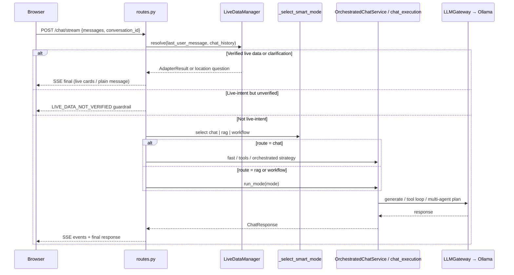
```mermaid
sequenceDiagram
    participant Browser
    participant Routes as routes.py
    participant LD as LiveDataManager
    participant Route as _select_smart_mode
    participant Orch as OrchestratedChatService / chat_execution
    participant LLM as LLMGateway → Ollama

    Browser->>Routes: POST /chat/stream {messages, conversation_id}
    Routes->>LD: resolve(last_user_message, chat_history)
    alt Verified live data or clarification
        LD-->>Routes: AdapterResult or location question
        Routes-->>Browser: SSE final (live cards / plain message)
    else Live-intent but unverified
        Routes-->>Browser: LIVE_DATA_NOT_VERIFIED guardrail
    else Not live-intent
        Routes->>Route: select chat | rag | workflow
        alt route = chat
            Routes->>Orch: fast / tools / orchestrated strategy
        else route = rag or workflow
            Routes->>Orch: run_mode(mode)
        end
        Orch->>LLM: generate / tool loop / multi-agent plan
        LLM-->>Orch: response
        Orch-->>Routes: ChatResponse
        Routes-->>Browser: SSE events + final response
    end
```

Explicit mode endpoints (`/rag_chat`, `/workflow_chat`) still exist for callers that want to force a path.

---

### Retrieval-Augmented Chat (`POST /rag_chat`)

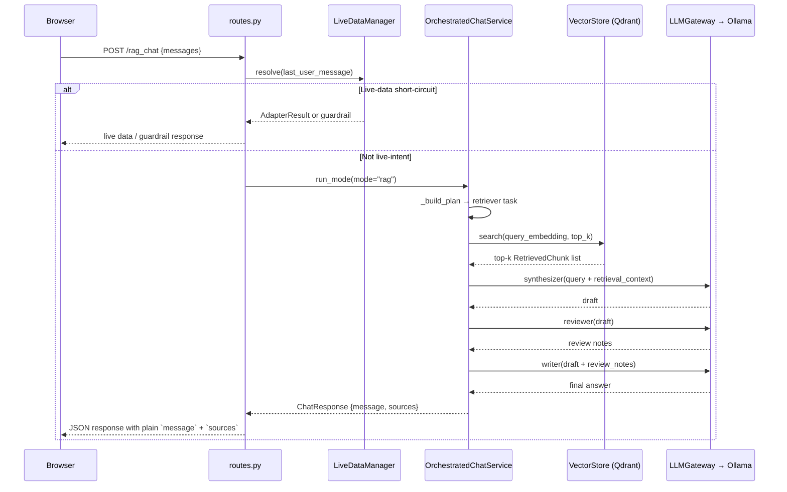
```mermaid
sequenceDiagram
    participant Browser
    participant Routes as routes.py
    participant LD as LiveDataManager
    participant Orch as OrchestratedChatService
    participant QD as VectorStore (Qdrant)
    participant LLM as LLMGateway → Ollama

    Browser->>Routes: POST /rag_chat {messages}
    Routes->>LD: resolve(last_user_message)
    alt Live-data short-circuit
        LD-->>Routes: AdapterResult or guardrail
        Routes-->>Browser: live data / guardrail response
    else Not live-intent
        Routes->>Orch: run_mode(mode="rag")
        Orch->>Orch: _build_plan → retriever task
        Orch->>QD: search(query_embedding, top_k)
        QD-->>Orch: top-k RetrievedChunk list
        Orch->>LLM: synthesizer(query + retrieval_context)
        LLM-->>Orch: draft
        Orch->>LLM: reviewer(draft)
        LLM-->>Orch: review notes
        Orch->>LLM: writer(draft + review_notes)
        LLM-->>Orch: final answer
        Orch-->>Routes: ChatResponse {message, sources}
        Routes-->>Browser: JSON response with plain `message` + `sources`
    end
```

---

### Multi-Agent Workflow Chat (`POST /workflow_chat`)

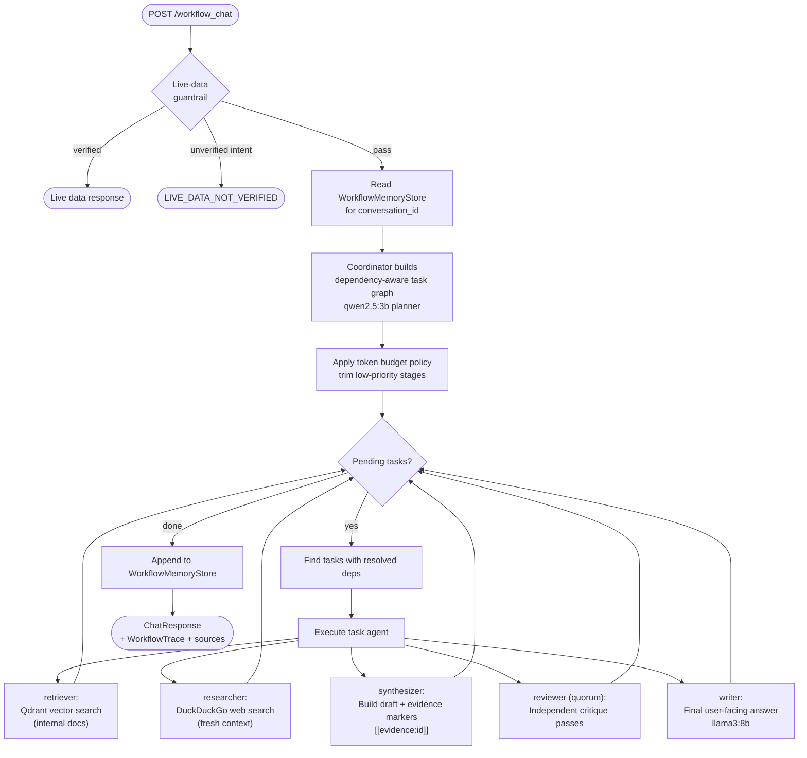
```mermaid
flowchart TD
    Start([POST /workflow_chat]) --> LiveGate{Live-data\nguardrail}
    LiveGate -- verified --> LiveResp([Live data response])
    LiveGate -- unverified intent --> GuardResp([LIVE_DATA_NOT_VERIFIED])
    LiveGate -- pass --> Memory[Read WorkflowMemoryStore\nfor conversation_id]
    Memory --> Plan[Coordinator builds\ndependency-aware task graph\nqwen2.5:3b planner]
    Plan --> Budget[Apply token budget policy\ntrim low-priority stages]
    Budget --> Loop{Pending tasks?}
    Loop -- yes --> Ready[Find tasks with resolved deps]
    Ready --> RunTask[Execute task agent]

    RunTask --> Retriever["retriever:\nQdrant vector search\n(internal docs)"]
    RunTask --> Researcher["researcher:\nDuckDuckGo web search\n(fresh context)"]
    RunTask --> Synthesizer["synthesizer:\nBuild draft + evidence markers\n[[evidence:id]]"]
    RunTask --> Reviewer["reviewer (quorum):\nIndependent critique passes"]
    RunTask --> Writer["writer:\nFinal user-facing answer\nllama3:8b"]

    Retriever --> Loop
    Researcher --> Loop
    Synthesizer --> Loop
    Reviewer --> Loop
    Writer --> Loop
    Loop -- done --> WriteMemory[Append to WorkflowMemoryStore]
    WriteMemory --> Respond([ChatResponse\n+ WorkflowTrace + sources])
```

---

### Streaming Workflow Events (`POST /workflow_chat/stream`)

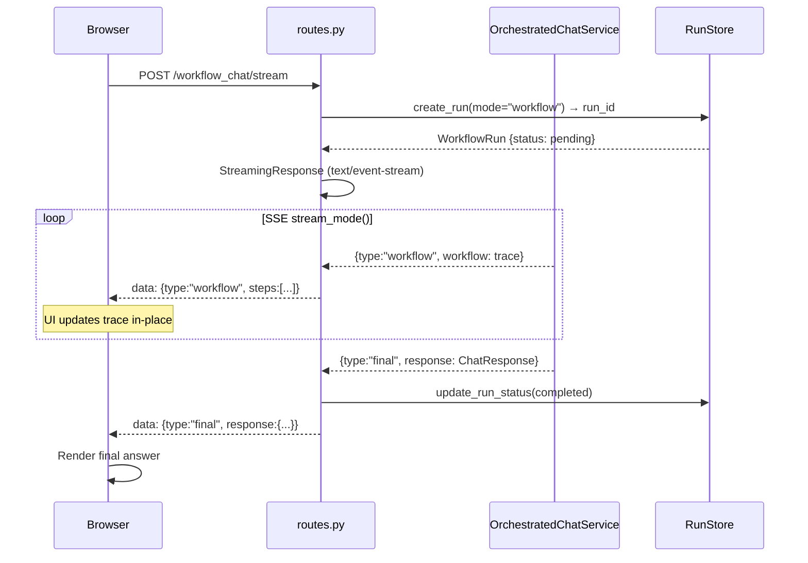
```mermaid
sequenceDiagram
    participant Browser
    participant Routes as routes.py
    participant Orch as OrchestratedChatService
    participant RS as RunStore

    Browser->>Routes: POST /workflow_chat/stream
    Routes->>RS: create_run(mode="workflow") → run_id
    RS-->>Routes: WorkflowRun {status: pending}
    Routes->>Routes: StreamingResponse (text/event-stream)

    loop SSE stream_mode()
        Orch-->>Routes: {type:"workflow", workflow: trace}
        Routes-->>Browser: data: {type:"workflow", steps:[...]}
        Note over Browser: UI updates trace in-place
    end

    Orch-->>Routes: {type:"final", response: ChatResponse}
    Routes->>RS: update_run_status(completed)
    Routes-->>Browser: data: {type:"final", response:{...}}
    Browser->>Browser: Render final answer
```

---

### Workflow Run Lifecycle

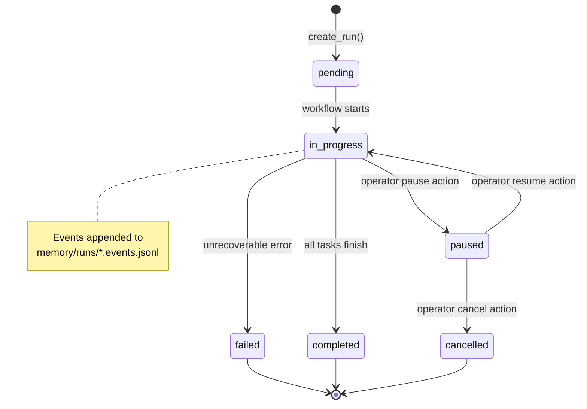
```mermaid
stateDiagram-v2
    [*] --> pending : create_run()
    pending --> in_progress : workflow starts
    in_progress --> completed : all tasks finish
    in_progress --> failed : unrecoverable error
    in_progress --> paused : operator pause action
    paused --> in_progress : operator resume action
    paused --> cancelled : operator cancel action
    failed --> [*]
    completed --> [*]
    cancelled --> [*]

    note right of in_progress
        Events appended to
        memory/runs/*.events.jsonl
    end note
```

---

### Document Ingestion (`POST /ingest`)

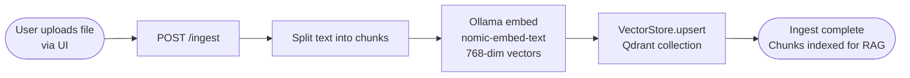
```mermaid
flowchart LR
    Upload([User uploads file\nvia UI]) --> Route[POST /ingest]
    Route --> Chunk[Split text into chunks]
    Chunk --> Embed[Ollama embed\nnomic-embed-text\n768-dim vectors]
    Embed --> Qdrant[VectorStore.upsert\nQdrant collection]
    Qdrant --> Done([Ingest complete\nChunks indexed for RAG])
```

---

### Evidence and Reviewer Quorum

```mermaid
flowchart TD
    Retrieval[Retriever chunks\ntrust_lane=retrieved] --> Evidence[Evidence pool\ntagged by trust lane]
    WebSearch[Web results\ntrust_lane=verified_web] --> Evidence
    Evidence --> Synth[Synthesizer\ncites evidence markers\n[[evidence:id]]]
    Synth --> Check{Evidence markers\npresent?}
    Check -- No markers,\nbut evidence exists --> Warn([Verification warning\ninstead of unsupported claim])
    Check -- Markers present --> Quorum[Reviewer quorum\ndefault 2 independent passes]
    Quorum --> Agg[Aggregate review notes]
    Agg --> Writer[Writer uses\nreviewed draft]
    Writer --> Final([Final answer])
```

---

### Safety and Governance Controls

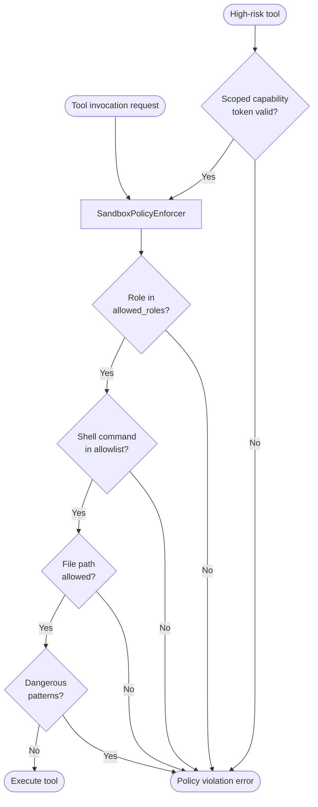
```mermaid
flowchart TD
    ToolInvoke([Tool invocation request]) --> Policy[SandboxPolicyEnforcer]
    Policy --> RoleCheck{Role in\nallowed_roles?}
    RoleCheck -- No --> Deny([Policy violation error])
    RoleCheck -- Yes --> CmdCheck{Shell command\nin allowlist?}
    CmdCheck -- No --> Deny
    CmdCheck -- Yes --> PathCheck{File path\nallowed?}
    PathCheck -- No --> Deny
    PathCheck -- Yes --> DangerCheck{Dangerous\npatterns?}
    DangerCheck -- Yes --> Deny
    DangerCheck -- No --> Exec([Execute tool])

    HighRisk([High-risk tool]) --> TokenCheck{Scoped capability\ntoken valid?}
    TokenCheck -- No --> Deny
    TokenCheck -- Yes --> Policy
```

---

## Frontend State Model

Chat history is **server-synced** (Postgres via TanStack Query). The UI does not persist messages in `localStorage`.

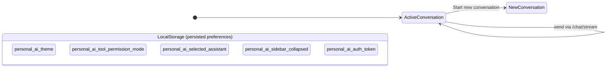
```mermaid
stateDiagram-v2
    direction LR
    [*] --> ActiveConversation
    ActiveConversation --> ActiveConversation : send via /chat/stream
    ActiveConversation --> NewConversation : Start new conversation

    state "LocalStorage (persisted preferences)" as LS {
        personal_ai_theme
        personal_ai_tool_permission_mode
        personal_ai_selected_assistant
        personal_ai_sidebar_collapsed
        personal_ai_auth_token
    }
```

**Key localStorage keys:**

| Key | Values | Description |
|-----|--------|-------------|
| `personal-ai-theme` | `light`, `dark` | UI theme |
| `personal-ai-tool-permission-mode` | `auto`, `ask`, `plan` | When tools run vs require approval |
| `personal-ai-selected-assistant` | assistant id | Active assistant in sidebar |
| `personal-ai-sidebar-collapsed` | boolean | Desktop sidebar rail state |
| `personal-ai-auth-token` | JWT | Session token when auth enabled |

Removed: `personal-ai-mode` (old Chat vs Smart toggle). Routing is automatic from the prompt.

---

## Data Stores

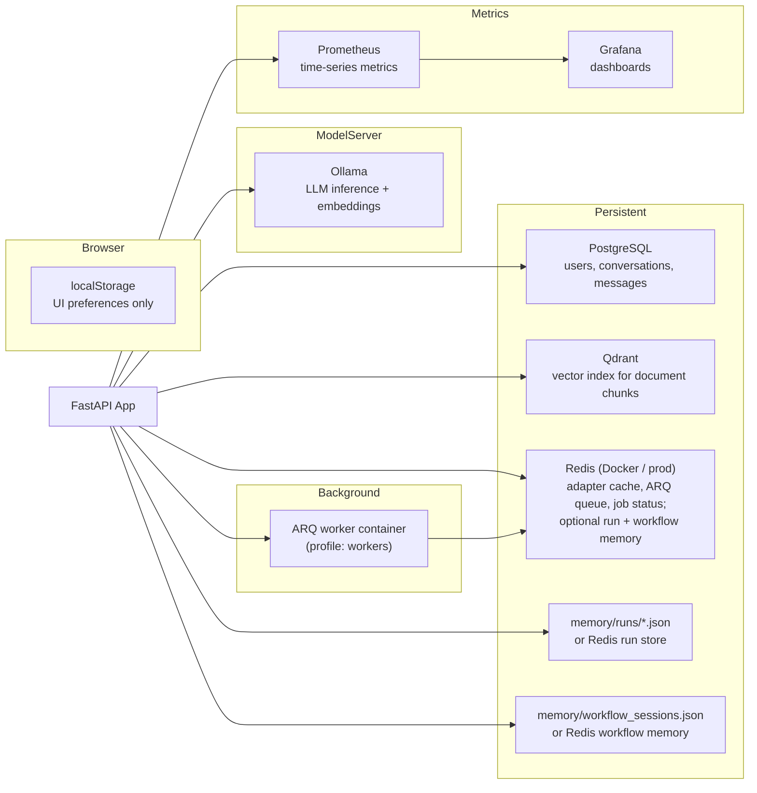
```mermaid
graph LR
    App["FastAPI App"]

    subgraph Persistent
        Postgres["PostgreSQL\nusers, conversations, messages"]
        Qdrant["Qdrant\nvector index for document chunks"]
        Redis["Redis (Docker / prod)\nadapter cache, ARQ queue, job status;\noptional run + workflow memory"]
        RunFiles["memory/runs/*.json\nor Redis run store"]
        MemoryFile["memory/workflow_sessions.json\nor Redis workflow memory"]
    end

    subgraph Background
        Worker["ARQ worker container\n(profile: workers)"]
    end

    subgraph ModelServer
        Ollama["Ollama\nLLM inference + embeddings"]
    end

    subgraph Browser
        LocalStorage["localStorage\nUI preferences only"]
    end

    subgraph Metrics
        Prometheus["Prometheus\ntime-series metrics"]
        Grafana["Grafana\ndashboards"]
    end

    App --> Postgres
    App --> Qdrant
    App --> Redis
    App --> RunFiles
    App --> MemoryFile
    App --> Worker
    Worker --> Redis
    App --> Ollama
    App --> Prometheus
    Prometheus --> Grafana
```

---

## Redis and Background Workers

Redis is always available in the Docker Compose stack. Usage depends on env:

| Concern | Setting | Default (code) | Docker app default |
|---------|---------|----------------|-------------------|
| Live-data cache | `ADAPTER_CACHE_BACKEND=redis` | `memory` | `redis` |
| Job queue | `WORKER_QUEUE_BACKEND=arq` | `arq` | `arq` |
| Workers enabled | `ENABLE_BACKGROUND_WORKERS` | `false` | `true` |
| Job status | `REDIS_URL` | optional | `redis://redis:6379/0` |
| Run store | `RUN_STORE_BACKEND` | `disk` | `disk` (Helm prod: `redis`) |
| Workflow memory | `WORKFLOW_MEMORY_BACKEND` | `disk` | `disk` (Helm prod: `redis`) |

**ARQ worker** (`make up-workers`): separate container running `arq app.workers.settings.WorkerSettings`.

| Task | Trigger |
|------|---------|
| `ingest_documents_task` | Large `POST /ingest` (≥5 docs or ≥32KB) |
| `run_workflow_task` | `POST /workflow_chat/background` |
| `scheduled_reports_tick` | Cron every 15 minutes |

Normal chat (`POST /chat/stream`) runs in the API process. Rebuild the app image after UI changes (`make build`) — the frontend is baked into `Dockerfile.backend`.

---

## Observability

- `GET /metrics` exposes Prometheus text format.
- `live_adapter_requests_total` — adapter hits labelled by domain, status, source, cache_hit.
- `live_adapter_latency_seconds` — provider latency histogram.
- Prometheus scrapes both itself and the app.
- Grafana is provisioned against the internal `http://prometheus:9090` compose address.

---

## Quality Gate

The repo-level gate is `scripts/quality_gate.sh`. It validates compose config, runs security checks, compiles Python, runs pytest, lints the frontend, builds the frontend, runs Playwright flow and visual tests, and builds the backend image.

---

## Key Constraints

- Live-intent queries must never fall through to unverifiable generation.
- The containerized app serves the frontend from the backend container, so UI changes require rebuilding the app image for compose-based verification.
- Local developer experience supports both direct backend/frontend development and full compose-based stack verification.