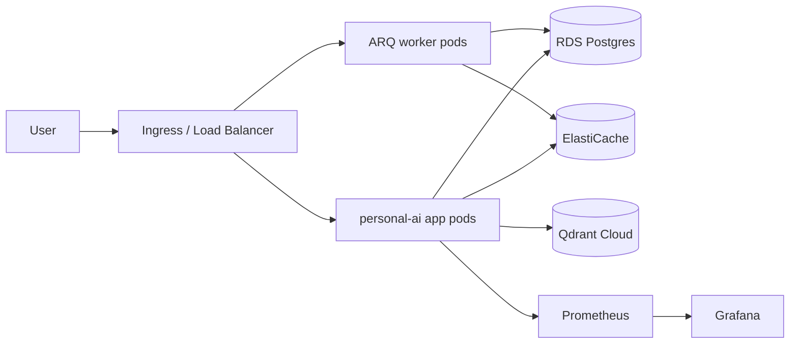

# AWS cloud deployment (EKS)

End-to-end path for running Personal AI on Amazon EKS with managed Postgres, Redis, and external Qdrant.

## Architecture



## 1. Build and push the image

```bash
docker build -f Dockerfile.backend -t <account>.dkr.ecr.<region>.amazonaws.com/personal-ai:latest .
aws ecr get-login-password --region <region> | docker login --username AWS --password-stdin <account>.dkr.ecr.<region>.amazonaws.com
docker push <account>.dkr.ecr.<region>.amazonaws.com/personal-ai:latest
```

## 2. Provision infrastructure

```bash
cd terraform/aws
cp terraform.tfvars.example terraform.tfvars
# Set postgres_password, jwt_secret, qdrant_url, container_image

terraform init
terraform apply
```

Capture outputs:

- `kubeconfig_command`
- `redis_url`
- `helm_env_snippet` (DATABASE_URL, REDIS_URL, Qdrant, backend flags)
- `secrets_manager_arn`

## 3. Configure kubectl

```bash
$(terraform output -raw kubeconfig_command)
kubectl get nodes
```

## 4. Deploy with Helm

```bash
helm upgrade --install personal-ai ./helm/personal-ai \
  --set image.repository=<account>.dkr.ecr.<region>.amazonaws.com/personal-ai \
  --set image.tag=latest \
  --set env.DATABASE_URL="<from terraform output>" \
  --set env.REDIS_URL="<from terraform output>" \
  --set env.QDRANT_URL="<your qdrant cloud url>" \
  --set env.AUTH_DISABLED=false \
  --set env.RUN_STORE_BACKEND=redis \
  --set env.WORKFLOW_MEMORY_BACKEND=redis \
  --set env.OBJECT_STORAGE_BACKEND=s3 \
  --set worker.enabled=true
```

Mount `JWT_SECRET` and `QDRANT_API_KEY` from AWS Secrets Manager (see `terraform/aws/secrets.tf`) via External Secrets Operator or CSI driver — do not bake secrets into Helm values in production.

## 5. Observability

1. Prometheus scrapes `/metrics` on the app Service (see `monitoring/prometheus.yml`).
2. Import `monitoring/grafana/dashboards/live-data.json`.
3. Watch **Live adapter error rate** and domain latency panels after go-live.

## 6. Live data configuration

Tune cache TTLs per domain in the app Deployment env:

| Variable | Default | Domain |
|----------|---------|--------|
| `LIVE_CACHE_TTL_FX_SECONDS` | 60 | FX rates |
| `LIVE_CACHE_TTL_STOCK_SECONDS` | 30 | Equities |
| `LIVE_CACHE_TTL_WEATHER_CURRENT_SECONDS` | 300 | Current weather |
| `LIVE_CACHE_TTL_WEATHER_FORECAST_SECONDS` | 900 | Forecasts |
| `LIVE_CACHE_TTL_NEWS_SECONDS` | 180 | Headlines |

Optional Finnhub market data:

```bash
MARKET_DATA_PROVIDER=finnhub
FINNHUB_API_KEY=<key>
```

## 7. Smoke test

```bash
kubectl port-forward svc/personal-ai 8000:8000
curl -s http://127.0.0.1:8000/health
curl -s -X POST http://127.0.0.1:8000/chat -H 'Content-Type: application/json' -d '{"message":"usd to inr"}' | jq '.live'
```

Successful live responses include a `live` object with `source`, `fetched_at_utc`, and `confidence`.

## GCP / Azure

Skeleton Terraform folders exist under `terraform/gcp` and `terraform/azure`. Follow the same Helm step once managed Postgres, Redis, and Kubernetes are wired.
