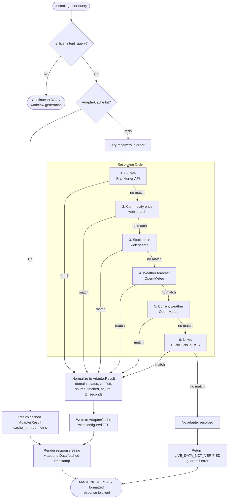
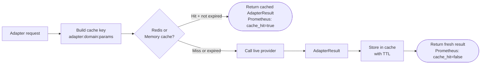
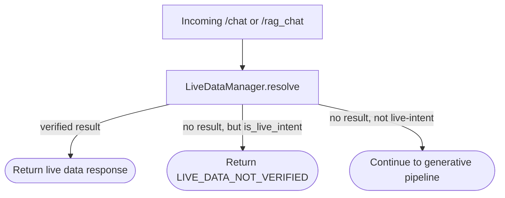

# Live Data Flow

## Goal

Live queries must return either verified provider data with timestamps or a deterministic guardrail error. They must not degrade into stale or hallucinated generation.

---

## End-to-End Live Data Flow

---

## Detection

`LiveDataManager.is_live_intent_query()` marks a prompt as live-intent when it matches one of these domains:

- FX conversion
- commodity pricing
- stock pricing
- current weather
- weather forecast
- news
- other freshness-sensitive prompts detected by the web-search heuristics

---

## Resolution Order

`LiveDataManager.resolve()` checks providers in this order:

1. FX
2. Commodity
3. Stock
4. Weather forecast
5. Current weather
6. News

This order matters because some weather prompts overlap and forecast intent should win before current-weather handling.

---

## Normalized Response Contract

All adapter responses are normalized into `AdapterResult`:

| Field | Description |
|-------|-------------|
| `domain` | Provider category (fx, weather, news, …) |
| `status` | `ok` or `error` |
| `verified` | `true` if provider confirmed the data |
| `source` | Human-readable provider name |
| `provider_timestamp` | Timestamp from the provider |
| `fetched_at_utc` | When this backend fetched the data |
| `ttl_seconds` | Cache TTL for this result |
| `data` | Raw provider payload dict |
| `error_code` | Machine-readable error code if status=error |
| `error_message` | Human-readable error if status=error |

---

## Cache Path

---

## API Guardrails

Both `/chat` and `/rag_chat` follow the same sequence:

---

## Rendering Rules

- Successful responses include `Fetched:` timestamps and source names.
- The API layer appends `Data fetched:` markers to enforce provenance in the user-facing payload.
- Error responses keep a deterministic terminal-style format so failure cases are predictable and testable.

---

## Metrics

| Metric | Labels | Description |
|--------|--------|-------------|
| `live_adapter_requests_total` | domain, status, source, cache_hit | Total adapter invocations |
| `live_adapter_latency_seconds` | domain, source | Provider call latency histogram |

These metrics are the main signal for cache efficiency, provider failures, and request mix across domains.