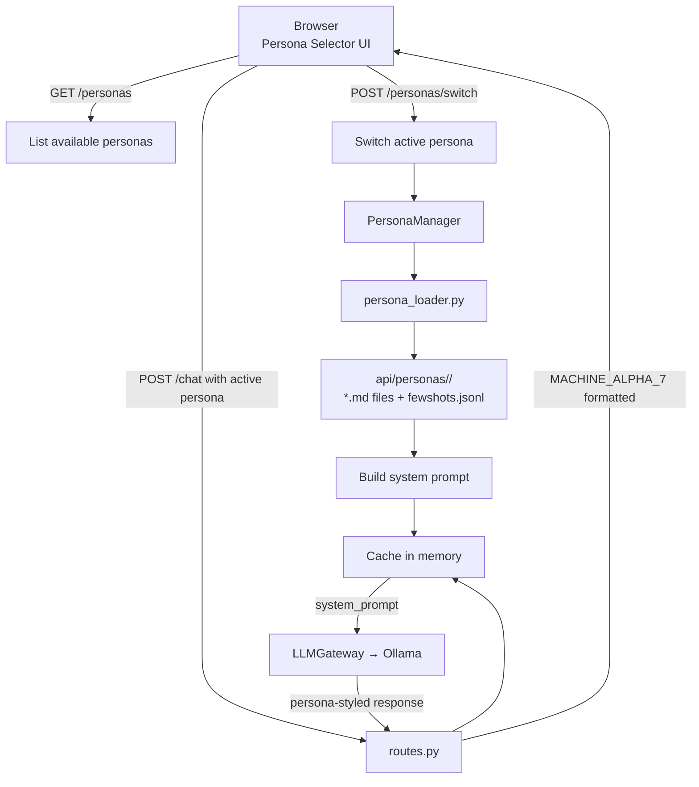

# Multi-Trait Persona System

## Overview

This chatbot now supports **multiple selectable personas/traits**. Instead of fine-tuning separate models (like BarneyBot), we use a single base model with **dynamic system prompts** that define different personality archetypes.

### Why This Approach is Better

| Approach | Model Count | Switching Speed | Deployment | Memory |
|----------|------------|-----------------|-----------|--------|
| **Fine-tuned (BarneyBot)** | One per persona | Slow (reload needed) | Heavy | High |
| **Our System Prompts** | One base model | Instant | Lightweight | Minimal |

---

## Architecture Diagram



---

## Architecture

### Components

1. **PersonaManager** (`app/services/persona_manager.py`)
   - Loads persona files from disk
   - Manages active persona state
   - Generates system prompts dynamically
   - Caches loaded personas for performance

2. **Persona Loader** (`api/persona_loader.py`)
   - Utility functions for loading persona directories
   - Supports merging multiple personas
   - Parses JSONL few-shots

3. **API Endpoints** (in `app/api/routes.py`)
   - `GET /personas` - List all available personas
   - `POST /personas/switch` - Change active persona
   - `GET /personas/active` - Get current persona
   - `POST /personas/preview` - Preview a persona's prompt

### Persona File Structure

Each persona is a directory under `api/personas/` with:

```
api/personas/therapist/
├── 00_identity.md           # Core mission & personality
├── 01_values.md             # 7 core values/traits
├── 02_decision_rules.md     # Decision trees & if/then rules
├── 03_style.md              # Tone, vocabulary, response shape
├── 04_emotion_rules.md      # Rules for handling emotions
├── 05_rubrics/              # Evaluation criteria
│   ├── validation.md
│   ├── exploration.md
│   └── boundaries.md
├── 06_negative_examples.md  # Anti-patterns to avoid
├── 07_glossary.md           # Preferred/banned terms
└── 08_fewshots.jsonl        # Example interactions
```

---

## Using the System

### Frontend Integration (Frontend Developers)

1. Call `GET /personas` to list available personas
2. Render as dropdown or selection UI
3. Call `POST /personas/switch` with selected persona
4. All subsequent `/chat` requests use the new persona

Example:
```javascript
// List personas
const personas = await fetch('/personas').then(r => r.json());

// Switch persona
await fetch('/personas/switch', {
  method: 'POST',
  body: JSON.stringify({ persona: 'therapist' })
});

// Chat now uses 'therapist' persona until switched again
```

### Backend Integration (Backend Developers)

The `PersonaManager` is instantiated per-request in routes.py:

```python
from app.services.persona_manager import PersonaManager

manager = PersonaManager()
current_prompt = manager.get_active_system_prompt()
```

For dynamic system prompts during chat:

```python
# In routes.py chat endpoint
manager = PersonaManager()
system_prompt = manager.get_active_system_prompt()

augmented_messages = [
    {"role": "system", "content": system_prompt},
    # ... rest of conversation
]

response = await ollama.chat(augmented_messages, ...)
```

---

## Creating a New Persona

### Step 1: Create Directory

```bash
mkdir api/personas/your_persona_name
```

### Step 2: Create Core Files

Create these files in order, using existing personas as templates:

- **00_identity.md** - 1-2 paragraph mission statement + key characteristics
- **01_values.md** - 7 core traits/values with behaviors and anti-patterns
- **02_decision_rules.md** - If/then decision trees for common scenarios
- **03_style.md** - Tone, vocabulary preferences, response structure guidelines
- **04_emotion_rules.md** - How to respond to specific emotions/situations
- **06_negative_examples.md** - 10-15 examples of behaviors to avoid

### Step 3: Create Supporting Files

- **07_glossary.md** - Preferred/banned terminology table
- **08_fewshots.jsonl** - 10 example user→assistant interactions
  - One JSON object per line
  - Keys: "user" and "assistant"
  - Shows the persona's communication style in action

### Step 4: Create Rubrics

```bash
mkdir api/personas/your_persona_name/05_rubrics
```

Create 3 evaluation rubrics with 5-point scales:
- **validation.md** (or similar) - Primary evaluation criterion
- **effectiveness.md** - Secondary criterion
- **boundaries.md** - Safety/limit criterion

### Step 5: Test

```python
from app.services.persona_manager import PersonaManager

manager = PersonaManager()
print(manager.list_personas())  # Should include your_persona_name
prompt = manager.get_persona_system_prompt('your_persona_name')
print(prompt[:500])  # Check it loaded correctly
```

---

## Example Personas Included

### 1. `ideal_chatbot` (Default)
- **Purpose**: Principled, user-centric assistant
- **Key Traits**: Intuitive, Coachable, Contextually Smart, Effective Communicator, Reliable, Well-Connected, Secure
- **Best For**: Programming help, technical questions, general Q&A

### 2. `therapist`
- **Purpose**: Empathetic, reflective, validating support
- **Key Traits**: Authentic empathy, Validation-first, Boundaried compassion, Respect for autonomy
- **Best For**: Emotional support, working through challenges, exploring feelings
- **Boundaries**: Clearly referred to professional help when needed

---

## API Examples

### List All Personas
```bash
curl http://localhost:8000/personas
```

Response:
```json
{
  "personas": ["ideal_chatbot", "therapist"],
  "active": "ideal_chatbot"
}
```

### Switch Persona
```bash
curl -X POST http://localhost:8000/personas/switch \
  -H "Content-Type: application/json" \
  -d '{"persona": "therapist"}'
```

Response:
```json
{
  "status": "switched",
  "active": "therapist"
}
```

### Preview a Persona
```bash
curl -X POST http://localhost:8000/personas/preview \
  -H "Content-Type: application/json" \
  -d '{"persona": "therapist"}'
```

Response:
```json
{
  "persona": "therapist",
  "system_prompt": "[Full system prompt for therapist...]",
  "length": 4821
}
```

### Chat with Active Persona
```bash
curl -X POST http://localhost:8000/chat \
  -H "Content-Type: application/json" \
  -d '{
    "messages": [
      {"role": "user", "content": "I'm feeling overwhelmed"}
    ]
  }'
```

(If active persona is "therapist", response will be empathetic and validating)

---

## Testing the System

### Unit Test Example

```python
import pytest
from app.services.persona_manager import PersonaManager

def test_persona_switching():
    manager = PersonaManager()
    
    # Check all personas load
    personas = manager.list_personas()
    assert 'ideal_chatbot' in personas
    assert 'therapist' in personas
    
    # Switch persona
    manager.set_active_persona('therapist')
    assert manager.get_active_persona() == 'therapist'
    
    # Get system prompt
    prompt = manager.get_persona_system_prompt('therapist')
    assert 'therapeutic' in prompt.lower() or 'empathy' in prompt.lower()
```

### Manual Testing Checklist

- [ ] List personas: `GET /personas` returns all personas
- [ ] Switch persona: `POST /personas/switch` changes active persona
- [ ] Preview persona: `POST /personas/preview` returns full prompt
- [ ] Chat with each persona: `POST /chat` produces different responses per persona
- [ ] Persona persistence: After switch, multiple chats use same persona
- [ ] Reload cache: `PersonaManager().reload_persona_cache()` clears old data

---

## Performance Notes

- **Caching**: PersonaManager caches loaded personas in memory (minimal overhead)
- **System Prompt Size**: Each persona's full prompt is ~3-5KB, well within token limits
- **Switching**: Instant; just an in-memory reference change
- **Disk I/O**: Only on first load of each persona per service restart

---

## Future Enhancements

Possible extensions to this system:

1. **Persona Blending**: Merge traits from multiple personas
   ```python
   blended = manager.merge_personas('ideal_chatbot', 'therapist')
   ```

2. **Dynamic Trait Injection**: Adjust traits based on conversation context
   ```python
   manager.set_trait_emphasis('empathy', weight=0.8)
   ```

3. **User Persona Preferences**: Save per-user persona preferences
   ```python
   user_preference = db.get_user_persona(user_id)
   manager.set_active_persona(user_preference)
   ```

4. **A/B Testing**: Run experiments comparing persona effectiveness
   ```python
   manager.create_experiment('therapist_vs_ideal', ['therapist', 'ideal_chatbot'])
   ```

5. **Fine-tuning Only When Needed**: Start with prompts, fine-tune high-usage personas
   ```bash
   python scripts/finetune_persona.py therapist --epochs 3
   ```

---

## Validation Strategy

When creating or updating a persona, validate against these criteria:

1. **Identity matches values**: Does 01_values.md support 00_identity.md? ✓
2. **Decision rules are concrete**: Can a non-expert follow them? ✓
3. **Style is consistent**: Do all examples match the tone in 03_style.md? ✓
4. **Emotion rules are safe**: Could these cause harm to vulnerable people? ✓
5. **Negative examples are clear**: Would someone recognize these violations? ✓
6. **Glossary is practical**: Can the model follow the preferred terminology? ✓
7. **Few-shots demonstrate style**: Do examples show the persona in action? ✓
8. **Rubrics are objective**: Would two reviewers agree on scores? ✓

---

## Troubleshooting

### Persona Not Listed
- Check directory exists: `api/personas/your_persona/`
- Ensure proper file names (00_, 01_, etc.)
- Clear cache: `PersonaManager().reload_persona_cache()`

### System Prompt Not Changing After Switch
- Verify endpoint was called: `GET /personas/active` shows new persona
- Check new PersonaManager instance is created per-request in routes.py
- Ensure chat endpoint uses `manager.get_active_system_prompt()`

### File Encoding Issues
- Save all `.md` files as UTF-8
- JSONL files should be one JSON object per line

### Large System Prompts
- If prompt > 2000 tokens, split into separate personas
- Or merge related files (e.g., identity + values)
