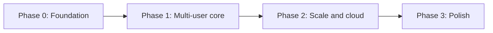

# Personal AI — Product Roadmap

This document tracks the phased plan to make Personal AI **multi-user**, **cloud-ready**, and **production-grade** while keeping **open-source LLMs** deployable locally or on cloud GPU.

**Status:** Phases 0–3 complete. See [Phase checklist](#phase-checklist) below.

---

## Goals

| Goal | Target outcome |
|------|----------------|
| Scalability | Stateless API replicas, DB-backed state, background workers |
| Multi-user | Authentication, per-user RAG isolation, server-side chat history |
| Simpler product | Single governed assistant (no persona switching) |
| Better UX | Server-synced conversations, streaming, resilient UI |
| Live data | Structured intent routing, better adapters, domain TTLs |
| Cloud deploy | Health probes, Helm/Terraform, split LLM embed vs chat |

## LLM strategy (unchanged preference)

- **Embeddings:** local Ollama (`nomic-embed-text`) or DMR embed model
- **Chat:** local Ollama **or** OpenAI-compatible endpoint (vLLM, TGI, Groq, etc.)
- **Orchestration:** keep Python `OrchestratedChatService` + `LLMGateway` per-stage routing

---

## Phase overview

| Phase | Focus | Exit criteria |
|-------|--------|---------------|
| **0** | Foundation | Personas removed; system prompt in file; `/health` + `/ready` |
| **1** | Multi-user core | Postgres + auth + conversation APIs; tenant-scoped ingest |
| **2** | Scale and cloud | React Query UI; worker queue; Helm; GPU LLM profiles |
| **3** | Polish | Live-data intent router; adapter upgrades; full cloud Terraform |

---

## Phase 0 — Foundation

**Objective:** Simplify the codebase and add operational basics before multi-user work.

### Tasks

- [x] Document this roadmap (`docs/roadmap.md`)
- [x] Move inline `SYSTEM_PROMPT` to `app/prompts/system.md` with loader + optional `SYSTEM_PROMPT_PATH` env
- [x] Add `GET /health` (liveness) and `GET /ready` (Qdrant + Ollama reachability)
- [x] Remove persona system (API, services, frontend UI, tests)
- [x] Update README and docs links
- [x] Tests pass for Phase 0 changes

### Notes

- Seven-trait governance lives in `app/prompts/system.md` (formerly hardcoded in `routes.py`).
- `docs/traits.md` remains the governance reference; persona-specific docs (`multi-trait-system.md`, `barney-persona.md`) are archived or removed.

---

## Phase 1 — Multi-user core

**Objective:** Real users, real persistence, tenant isolation.

### Backend

- [x] Add PostgreSQL (SQLAlchemy 2.0 + Alembic migrations)
- [x] Schema: `users`, `conversations`, `messages`, `documents`
- [x] Auth: OIDC/JWT via `fastapi` dependency (`AUTH_DISABLED` for local dev)
- [x] Conversation CRUD APIs:
  - `GET /conversations`
  - `POST /conversations`
  - `GET /conversations/{id}/messages`
  - `DELETE /conversations/{id}`
- [x] Wire chat routes (`/chat`, `/rag_chat`, `/workflow_chat`, `/smart_chat` + streams) to persist messages
- [x] Scope ingest route to `user_id` from token
- [x] Qdrant payload filter: `user_id` on every upsert/search
- [x] Scope workflow run routes to `user_id` from token
- [x] User-scope `WorkflowMemoryStore` / `RunStore` (per-user paths + optional Redis backends)

### Frontend

- [x] Login flow (or dev bypass via `AUTH_DISABLED` + `/auth/token`)
- [x] Send `Authorization` header on all API calls
- [x] Stop persisting chat history in `localStorage` (keep theme/mode only)

### Exit criteria

- Two users cannot see each other's conversations or documents
- Chat history survives browser refresh and device change

---

## Phase 2 — Scale and cloud readiness

**Objective:** Run multiple API replicas; deploy to Azure/GCP/AWS.

### Application

- [x] Background workers (ARQ + Redis) for ingest and long workflows
- [x] Object storage for uploads (local + S3-compatible)
- [x] Move `memory/runs/` and workflow sessions off local disk in production (`RUN_STORE_BACKEND=redis`, `WORKFLOW_MEMORY_BACKEND=redis`)

### Frontend

- [x] TanStack Query for conversations/messages
- [x] Error boundaries, retry, optimistic send
- [x] Virtualized message list for long threads

### Infrastructure

- [x] `GET /health` + `GET /ready` used as K8s probes (Helm templates)
- [x] Helm chart (app, worker, env templates)
- [x] Compose profiles: `local`, `cloud-chat`, `gpu-vllm`
- [x] Document GPU deployment: vLLM/TGI for chat, Ollama for embeds (`docs/gpu-deployment.md`)

### Exit criteria

- Two API replicas share state via Postgres + Redis
- One-command deploy to a K8s cluster with external Postgres and Qdrant

---

## Phase 3 — Live data and polish

**Objective:** More accurate live answers and production hardening.

### Live data

- [x] Structured intent router (domain + slots) before adapter chain
- [x] Geocoding for weather queries (cached Open-Meteo geocoder)
- [x] Domain-specific cache TTLs (FX, weather, news) via env
- [x] Optional dedicated market data provider (`MARKET_DATA_PROVIDER=finnhub`)
- [x] Return provenance (`source`, `fetched_at`, `confidence`) in live API responses

### Cloud templates

- [x] Terraform modules: Azure AKS, GCP GKE, AWS EKS (minimal viable; AWS documented end-to-end)
- [x] Managed Postgres + Redis + Qdrant Cloud wiring (AWS Terraform + Helm)
- [x] Secrets via Key Vault / Secret Manager / Secrets Manager (AWS Secrets Manager module)

### Exit criteria

- Live-data failure rate visible in Grafana; top domains improved
- README documents one cloud path end-to-end

---

## Phase checklist

Update this table as phases complete.

| Phase | Status | Completed |
|-------|--------|-----------|
| 0 — Foundation | **Complete** | 2026-06-17 |
| 1 — Multi-user core | **Complete** | 2026-06-17 |
| 2 — Scale and cloud | **Complete** (Terraform deferred to Phase 3) | 2026-06-17 |
| 3 — Live data and polish | **Complete** | 2026-06-17 |

---

## Related docs

- [architecture.md](architecture.md) — current system design
- [gpu-deployment.md](gpu-deployment.md) — GPU vLLM + Helm probes
- [compose-profiles.md](compose-profiles.md) — Docker Compose profile reference
- [cloud-deploy-aws.md](cloud-deploy-aws.md) — EKS + RDS + Redis + Helm
- [testing-accuracy.md](testing-accuracy.md) — routing golden set and isolation evals
- [live-data-flow.md](live-data-flow.md) — live adapter pipeline
- [deployment-checklist.md](deployment-checklist.md) — pre-release checks
- [traits.md](traits.md) — seven-trait assistant governance

---

## Working agreement

1. **One phase at a time** — finish exit criteria before starting the next.
2. **Tests per phase** — each phase updates or adds tests for new behavior.
3. **No big-bang rewrite** — extend `LLMGateway` and orchestration; don't replace the stack.
4. **Open-source LLM first** — cloud provider blocks remain optional overlays (`docker-compose.cloud.yml`).
